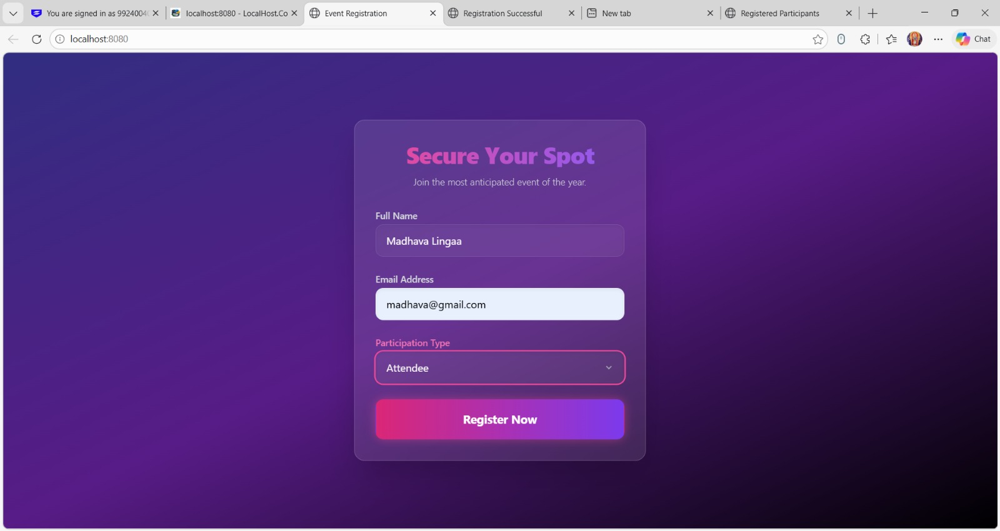
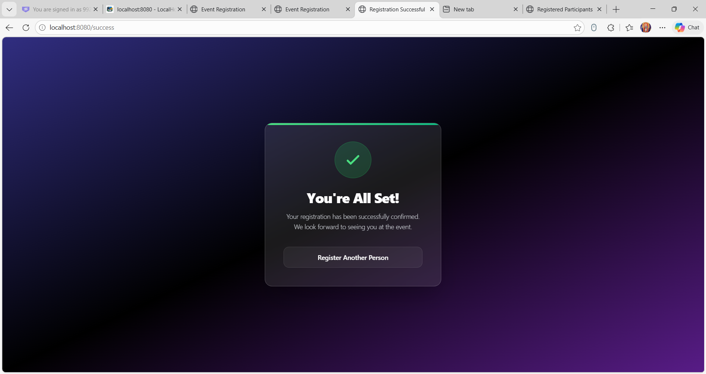
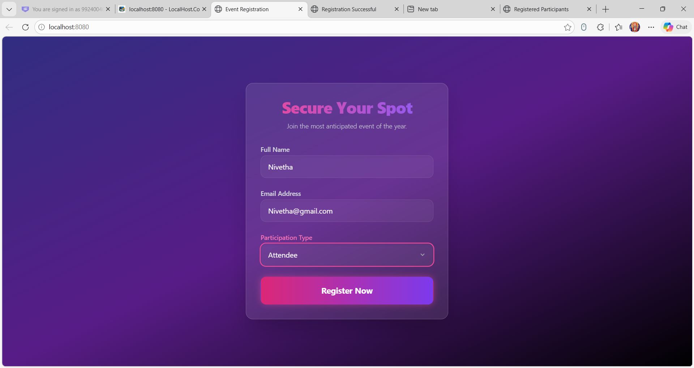
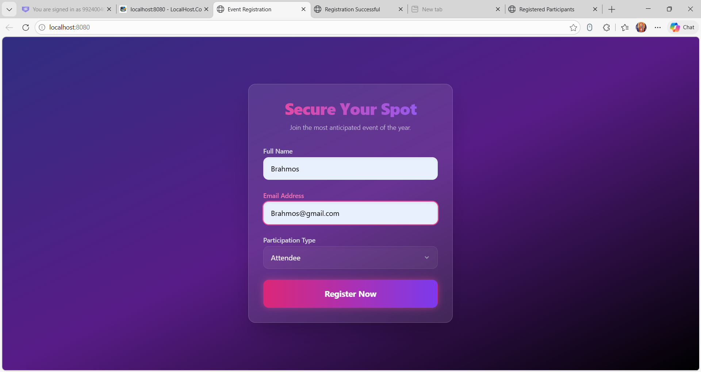

# Event Registration Portal 🎟️

A zero-friction, visually stunning event registration portal that maximizes conversion rates through a premium user interface, backed by a lightweight, foolproof data-capture system.

## 🌟 Features

*   **"No Compromise" UI**: A modern, glassmorphism-inspired interface utilizing dynamic gradients, hover states, and flawless responsiveness.
*   **Frictionless Onboarding**: Single-page application flow requiring no account creation or login to register.
*   **Instant Confirmation**: Immediate visual feedback upon successful registration.
*   **Zero-Config Backend**: Plug-and-play Spring Boot server environment that requires no external database installation.
*   **Organizer Dashboard**: Dedicated view (`/participants`) to easily list and visualize all registered attendees.

## 🚀 Technologies Used

**Frontend:**
*   **HTML5 / Thymeleaf**: Semantic structure and dynamic server-side rendering.
*   **Tailwind CSS (via CDN)**: Utility-first framework providing high-end styling, glassmorphism (`backdrop-blur`), and modern gradients without a complex build pipeline.

**Backend:**
*   **Java 8**: Robust, strictly-typed language powering the logic.
*   **Spring Boot (2.7.18)**: Drastically reduces boilerplate, auto-configures the server (embedded Tomcat).
*   **Spring Data JPA**: Abstraction layer over JDBC for effortless database interactions.
*   **H2 Database Engine**: Lightweight, in-memory relational database requiring zero external setup.

## 📸 Screenshots

*(Please replace these placeholders by saving your screenshots into the `asset` folder)*

### 1. Registration Form (`/`)

*The glassmorphism-inspired registration form where users input their details.*

### 2. Success Confirmation (`/success`)

*Instant visual feedback after a successful registration.*

### 3. Organizer Dashboard (`/participants`)

*The backend view for event organizers to see all registered participants.*

### 4. Admin View

*The administrative view for extended control over the event data.*

### 5. Sample View

*A sample overview illustrating further capabilities of the application.*

## ⚙️ Getting Started

### Prerequisites
*   **Java Development Kit (JDK) 8 or higher**
*   **Maven** (optional, as the Maven Wrapper `mvnw` is included)

### Running Locally

1.  **Clone or Open the Project**
    Navigate to the project directory in your terminal:
    ```bash
    cd event-registration
    ```

2.  **Start the Application**
    Run the application using the included Maven Wrapper:
    
    **Windows:**
    ```powershell
    .\mvnw spring-boot:run
    ```
    
    **Mac/Linux:**
    ```bash
    ./mvnw spring-boot:run
    ```

3.  **Access the Application**
    *   **Registration Portal**: Open `http://localhost:8080/` in your web browser.
    *   **Organizer Dashboard**: Open `http://localhost:8080/participants`
    *   **H2 Database Console**: Open `http://localhost:8080/h2-console`
        *   **JDBC URL**: `jdbc:h2:mem:registrationdb`
        *   **Username**: `sa`
        *   **Password**: `password`

## 📁 Project Structure

```text
event-registration/
├── pom.xml                 # Maven dependencies and build configuration
├── src/
│   └── main/
│       ├── java/
│       │   └── com/example/event_registration/
│       │       ├── EventRegistrationApplication.java
│       │       ├── controller/
│       │       │   └── RegistrationController.java   # Handles HTTP routing
│       │       ├── model/
│       │       │   └── Participant.java              # Database Entity
│       │       └── repository/
│       │           └── ParticipantRepository.java    # Database operations
│       └── resources/
│           ├── application.properties                # H2 and Server Config
│           └── templates/
│               ├── registration.html                 # Registration UI
│               ├── success.html                      # Success UI
│               └── participants.html                 # Organizer UI
└── asset/                  # Storage for README screenshots
```
